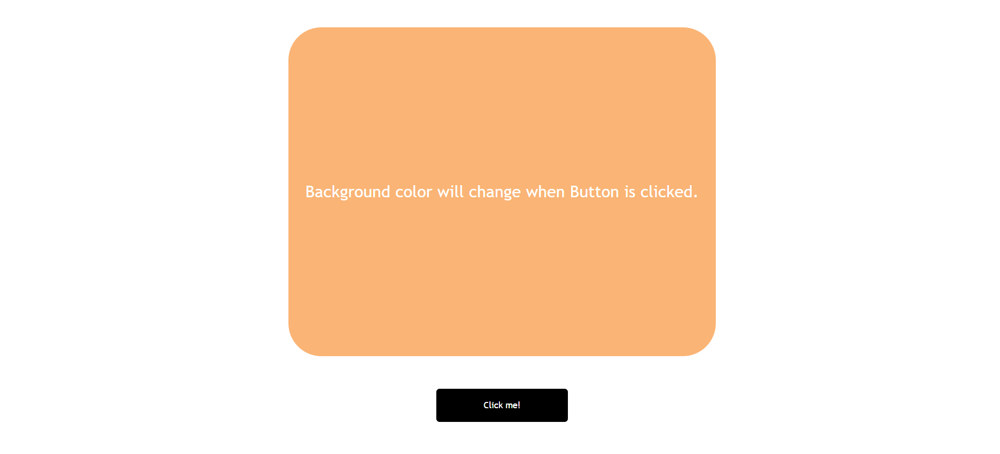

## What to build

we have to build BackGround color changer.

## Input

## Techanology used

we have used HTML, CSS and JavaScript DOM

## What I have learned from this project

I have learned how to change background color of a div when ever clicking button, and how to generate hexadecimal number and convert that in 6 digit color code.

## Output

### Instructor

**Hitesh choudhary**
